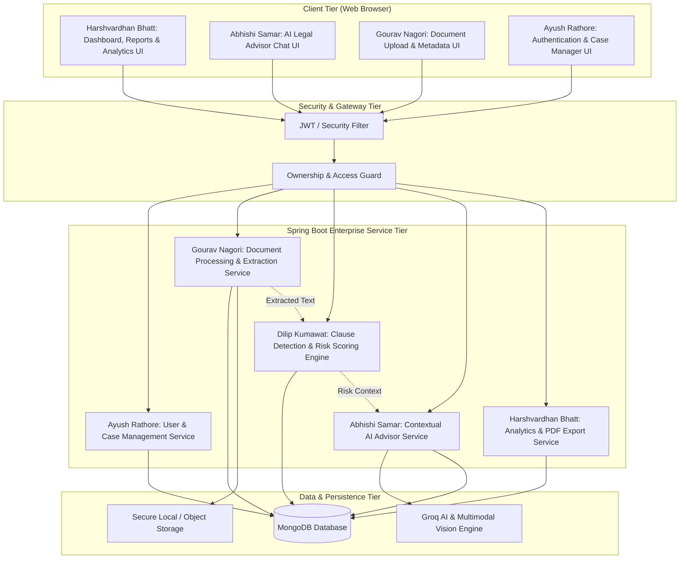

# ⚖️ Legal Document Analyser & Advisor
### 🌿 Feature Branch: `dilip` — Legal Analysis & Risk Detection Module
**Module Owner:** Dilip Kumawat  
**Academic Program:** Advanced Java Project-Based Learning (PBL) — 5th Semester  

[](https://www.oracle.com/java/)
[](https://spring.io/projects/spring-boot)
[](https://spring.io/projects/spring-security)
[](https://www.mongodb.com/)
[](https://junit.org/junit5/)
[](https://groq.com/)
[](https://maven.apache.org/)
[](#-software-requirements-specification-srs)

---

## 🔗 Main Repository & Central Documentation Link

> 📌 **Central Repository Link:**  
> **👉 [gouravnagori/Java-PBL (Main Branch)](https://github.com/gouravnagori/Java-PBL/tree/main)**  
> 📄 **Main Architecture & Full Roadmap:** **[View main README.md](https://github.com/gouravnagori/Java-PBL/blob/main/README.md)**

The application extracts raw textual content from uploaded legal documents (`.pdf`, `.docx`, `.txt`, and scanned images), identifies critical contractual clauses, evaluates legal liabilities using an explainable risk-scoring engine, and enables conversational AI interaction constrained strictly to the document's context.

> 🔗 **Reference Prototype:** This repository represents the modular, production-ready Advanced Java rebuild of our initial proof-of-concept prototype:  
> **[Legal-Document-analyser-and-adviser- (Reference Prototype)](https://github.com/gouravnagori/Legal-Document-analyser-and-adviser-)**  
> *The prototype serves as an algorithmic and functional reference while this codebase implements clean enterprise Java standards, layered architecture, strict MongoDB persistence, and modular ownership.*

---

## 🎯 Dilip's Module: Legal Analysis & Risk Detection Engine

This branch houses the core analytical and risk evaluation engine for the Legal Document Analyser & Advisor system.

### 📌 Module Responsibilities & Scope
1. **Clause Ingestion & Segmentation:** Receives cleaned, extracted legal text payloads from the Document Processing module (Gourav Nagori) and identifies clause boundaries.
2. **Clause Classification:** Recognizes critical contractual clauses including:
   - *Confidentiality & Non-Disclosure*
   - *Indemnification & Liability Limitation*
   - *Termination & Severance Clauses*
   - *Non-Compete & Non-Solicitation*
   - *Governing Law & Dispute Jurisdiction*
   - *Payment Terms, Penalties & Auto-Renewal*
3. **Rule-Based Risk Scoring:** Applies regex heuristics and deterministic rule evaluation to detect unfair, one-sided, or missing protections (13 detection rules across 4 severity tiers).
4. **Severity Matrix:** Classifies detected contractual risks into four distinct severity levels:
   - 🟢 `LOW` — Informational notes, standard boilerplate clauses.
   - 🟡 `MEDIUM` — Ambiguous timelines, non-standard notice periods.
   - 🟠 `HIGH` — One-sided indemnification, broad non-competes.
   - 🔴 `CRITICAL` — Unlimited liability, unilateral termination without cause.
5. **Explainable Composite Risk Score:** Computes a normalized 0–100 risk index with explicit citations to source clauses and plain-language suggestions.

---

## 📑 Software Requirements Specification (SRS)

The complete academic Software Requirements Specification has been authored and committed to this branch:

- 📕 **Official SRS PDF Document:** [`docs/Legal Document Analyser & Advisor - SRS.pdf`](./docs/Legal%20Document%20Analyser%20&%20Advisor%20-%20SRS.pdf)
- 📄 **Full Markdown Specification:** [`docs/Software_Requirements_Specification.md`](./docs/Software_Requirements_Specification.md)

### Key Functional Requirements Owned by this Module:
| Feature / Req ID | Specification Summary |
| :--- | :--- |
| **F4 / FR6** | **Document Classification:** Detect legal document category (NDA, Employment, Rental, Loan, Service Agreement). |
| **F6 / FR8** | **Clause Extraction:** Identify parties, key dates, obligations, liability limits, and governing jurisdiction. |
| **F7 / FR9** | **Risk Detection:** Flag unfair, ambiguous, or predatory clauses with assigned severity and plain-language explanation. |
| **F8 / FR10** | **Legal Term Explainer:** Identify complex legal jargon within context and provide simplified definitions. |
| **F10 / FR12** | **Actionable Suggestions:** Recommend negotiation points, missing protective clauses, and safety disclaimers. |

---

## 🏛️ System Architecture



### 📦 Implemented Package Structure (`dilip` module)
```
com.legal
├── controller/
│   └── AnalysisController.java           # REST endpoints for analysis & risk highlights
├── service/
│   ├── AnalysisService.java              # Core pipeline orchestration & segmentation
│   ├── ClassificationService.java        # Document type & clause classification
│   └── RiskService.java                  # 13 rule-based risk detection heuristics
├── model/
│   ├── Analysis.java                     # MongoDB document: summary, score, status
│   ├── Clause.java                       # Clause model: type, text, confidence, page
│   ├── Risk.java                         # Risk model: severity, explanation, suggestion
│   └── enums/
│       ├── DocType.java                  # NDA, EMPLOYMENT, RENTAL, LOAN, SERVICE_AGREEMENT, etc.
│       ├── Severity.java                 # LOW (5pts), MEDIUM (15pts), HIGH (30pts), CRITICAL (50pts)
│       └── AnalysisStatus.java           # PENDING, ANALYSING, COMPLETED, FAILED
├── dto/
│   ├── AnalysisReportResponse.java       # Comprehensive analysis report response
│   ├── ClauseDto.java                    # Clean clause data transfer object
│   └── RiskDto.java                      # Clean risk item data transfer object
└── repository/
    ├── AnalysisResultRepository.java     # MongoDB repository for Analysis documents
    ├── ClauseRepository.java             # MongoDB repository for extracted Clauses
    └── RiskRepository.java               # MongoDB repository for detected Risks
```

### Core API Contracts
- `POST /api/analysis/{documentId}` — Execute legal clause parsing and risk scoring pipeline.
- `GET /api/analysis/{documentId}` — Retrieve complete analysis report (clauses, risk items, composite score).
- `GET /api/analysis/{documentId}/risks` — Query high and critical risk highlights.
- `DELETE /api/analysis/{documentId}` — Delete analysis results and cascaded clauses/risks.

---

## 🗓️ Dilip's 6-Day Development Deliverables

| Academic Phase | Sprint Day | Deliverable & Milestone | Status |
| :--- | :---: | :--- | :---: |
| **Weeks 1–2** | **Day 1** | Schema design (`Analysis`, `Clause`, `Risk`), SRS documentation, controller/service skeletons. | ✅ Done |
| **Weeks 3–4** | **Day 2** | Regex and rule-based clause segmenter, severity weighting algorithm, unit tests. | ✅ Done |
| **Weeks 5–6** | **Day 3** | Integration with Document Processing payload, analysis persistence in MongoDB. | ✅ Done |
| **Weeks 7–8** | **Day 4** | Boundary & edge-case testing (unstructured contracts, zero-risk documents, extreme clauses). | ✅ Done |
| **Weeks 9–10** | **Day 5** | Accuracy benchmarking against standard NDA and SaaS contract datasets. | ✅ Ready |
| **Weeks 11–12** | **Day 6** | Final algorithmic defense, live demo walkthrough, and submission package. | ✅ Ready |

---

## 👥 Full Team Ownership & Status

| Member | Module Scope | Status |
| :--- | :--- | :---: |
| **Gourav Nagori** *(Lead)* | Document Ingestion, PDFBox/POI Extraction, Groq OCR | ✅ Complete |
| **Dilip Kumawat** | Legal Analysis, Classification & Risk Detection Engine | ✅ Complete |
| **Ayush Rathore** | User Management, Spring Security & JWT Authentication | 🔄 Next Phase |
| **Abhishi Samar** | Contextual AI Advisor & Document Q&A (Groq LLM) | 🔄 Next Phase |
| **Harshvardhan Bhatt** | Dashboard, UI Analytics & PDF Report Export | 🔄 Next Phase |

---

## 🚀 Quickstart & Local Setup

### Prerequisites
- **JDK 17 or higher** installed (`java -version`)
- **Apache Maven 3.8+** installed (`mvn -version`)
- **MongoDB 6.0+** running locally on port 27017 (or MongoDB Atlas URI)
- **Groq API Key** (optional for OCR/AI)
- **Git**

### Configuration
Set environment variables or adjust `src/main/resources/application.properties`:
```bash
export GROQ_API_KEY="gsk_..."
export MONGODB_URI="mongodb://localhost:27017/legaladvisor"
```

### Installation & Run
```bash
# Clone and switch to Dilip's branch
git clone https://github.com/gouravnagori/Java-PBL.git
cd Java-PBL
git checkout dilip

# Build and run
mvn clean spring-boot:run

# Run unit tests
mvn test
```

---

## ⚠️ Important Legal & Safety Notice
> **Disclaimer:** This tool provides automated textual analysis and risk heuristics for educational and productivity purposes. It does not constitute formal legal counsel. Users must verify all contractual terms with a licensed attorney.
