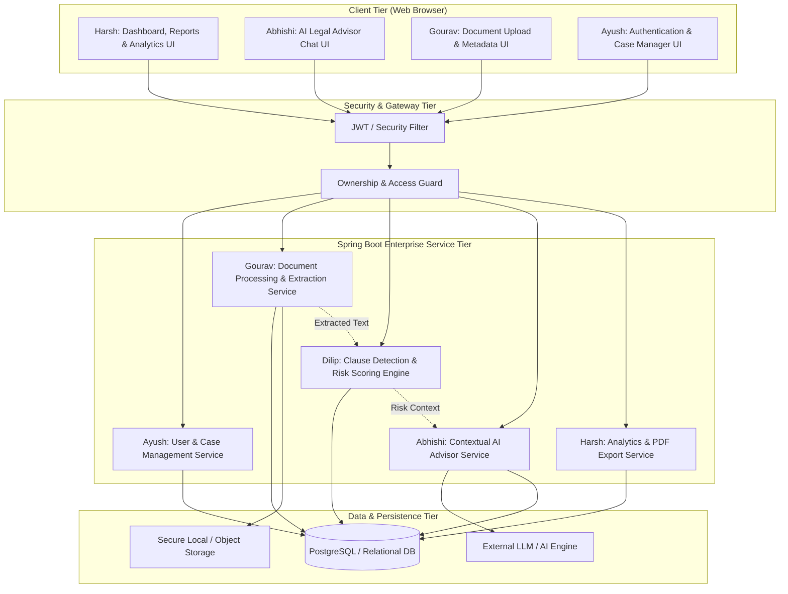

# ⚖️ Legal Document Analyser & Advisor
### *Advanced Java Project-Based Learning (PBL) — 5th Semester*

[](https://www.oracle.com/java/)
[](https://spring.io/projects/spring-boot)
[](https://spring.io/projects/spring-security)
[](https://www.postgresql.org/)
[](https://maven.apache.org/)
[](#system-architecture)

---

## 📌 Executive Summary

**Legal Document Analyser & Advisor** is an enterprise-grade Java web application designed to automate the ingestion, analysis, clause risk assessment, and document-aware advisory for complex legal contracts and agreements (e.g., NDAs, Employment Agreements, Service Contracts, Terms of Service).

The application extracts raw textual content from uploaded legal documents (`.pdf`, `.docx`), identifies critical contractual clauses, evaluates legal liabilities using an explainable risk-scoring engine, and enables conversational AI interaction constrained strictly to the document's context.

> 🔗 **Reference Prototype:** This repository represents the modular, production-ready Advanced Java rebuild of our initial proof-of-concept prototype:  
> **[Legal-Document-analyser-and-adviser- (Reference Prototype)](https://github.com/gouravnagori/Legal-Document-analyser-and-adviser-)**  
> *The prototype serves as an algorithmic and functional reference while this codebase implements clean enterprise Java standards, layered architecture, strict database persistence, and modular ownership.*

---

## ⚠️ Important Legal & Safety Disclaimer

> ### ⚖️ Informational Tool Disclaimer
> **This software is an AI-assisted informational and productivity tool.**  
> - It **does NOT** provide formal legal advice, legal representation, or binding contract certification.
> - The risk scores, clause classifications, and conversational explanations generated by the system are for educational, informational, and triage purposes only.
> - Users and organizations should always consult a licensed attorney or qualified legal professional before executing legal agreements or relying on automated risk evaluations.

---

## 🎓 Academic Focus (Advanced Java PBL)

This project strictly adheres to 5th-Semester Advanced Java curriculum standards and best practices:

| Core Concept | Implementation Detail |
| :--- | :--- |
| **Framework & REST Services** | Spring Boot 3 web layer providing clean, stateless RESTful APIs. |
| **Persistence & ORM** | Spring Data JPA with Hibernate for relational mapping, entity lifecycle management, and transactional boundaries. |
| **Authentication & Security** | Spring Security with BCrypt password hashing, role/ownership enforcement, and stateless session management / JWT. |
| **File I/O & Extraction** | Apache Tika / Apache POI / PDFBox for high-throughput stream processing of multi-page legal documents. |
| **Robust Exception Handling** | Global exception handlers (`@ControllerAdvice`, `@ExceptionHandler`) with standardized API error responses. |
| **Design Patterns** | Controller-Service-Repository pattern, DTO pattern, Factory & Strategy patterns for clause analysis, and Service Abstractions. |
| **Testing & Quality** | Unit & integration testing using JUnit 5, Mockito, and Spring Boot Test slices. |

---

## 🏛️ System Architecture



---

## 👥 Team Members & 5-Module Ownership

> **🚨 Strict Team Policy:**  
> Every team member owns a complete functional module end-to-end. No member is solely assigned to documentation, slides, or repository maintenance. Each individual has dedicated backend/frontend source code, unit tests, and a demonstrable live feature path.

| Member | Module Name | Primary Technical Responsibility | Core Academic Deliverable |
| :--- | :--- | :--- | :--- |
| **Gourav** *(Lead)* | **Document Management & Processing** | File upload, validation, secure storage, PDF/DOCX parsing & extraction, document lifecycle states | Multipart upload APIs, text extraction engine, document metadata & status management |
| **Dilip** | **Legal Analysis & Risk Detection** | Clause segmentation, legal risk classification, explainable scoring rules, risk severity matrix | Rule-based & regex clause parser, weighted risk score algorithm, analysis persistence |
| **Abhishi** | **AI Legal Advisor / Q&A** | Context-bounded document Q&A, plain-language summaries, legal disclaimer enforcement, chat memory | AI service abstraction, prompt engineering with document grounding, conversation history APIs |
| **Ayush** | **User, Authentication & Case Management** | User registration, authentication, JWT/session security, RBAC, user dashboard, ownership mapping | Spring Security filter chain, BCrypt hashing, multi-tenant document isolation & access control |
| **Harsh** | **Reports, Analytics & Integration** | Analytical dashboards, aggregation metrics, structured report view, PDF export, system integration | Dashboard risk visualization, PDF report generation engine, end-to-end integration coordinator |

---

### 📦 Deep-Dive: Module Breakdown & Demo Paths

#### 1. Gourav — Document Management & Processing
* **Module Scope:** Serves as the ingestion gateway for legal contracts.
* **Key Responsibilities:**
  - Secure Multipart upload supporting `.pdf` and `.docx` with mime-type and size validation (max 15MB).
  - Persistence of file metadata (filename, storage URI, checksum, page count, upload timestamp).
  - High-performance text extraction using Apache Tika / PDFBox / POI.
  - Document lifecycle management: `UPLOADED` ➔ `PROCESSING` ➔ `PROCESSED` ➔ `FAILED`.
  - Exposing document retrieval and raw content APIs for downstream analysis modules.
* **Demo Path:** `Login` ➔ `Upload Contract (.pdf/.docx)` ➔ `View Extracted Text & Metadata` ➔ `Verify Lifecycle Status`.
* **Key API Contracts:**
  - `POST /api/documents/upload` — Ingest document & initiate asynchronous extraction.
  - `GET /api/documents/{id}` — Fetch document metadata and status.
  - `GET /api/documents/{id}/content` — Stream extracted clean text payload.

---

#### 2. Dilip — Legal Analysis & Risk Detection
* **Module Scope:** Serves as the core analytical engine parsing clauses and scoring contractual liability.
* **Key Responsibilities:**
  - Ingestion of extracted text from Gourav's module.
  - Clause identification and boundary classification (e.g., *Confidentiality*, *Indemnification*, *Non-Compete*, *Termination*, *Governing Law*).
  - Rule-based risk detection identifying predatory or ambiguous language (e.g., unlimited liability, unilateral renewal).
  - Severity classification (`LOW`, `MEDIUM`, `HIGH`, `CRITICAL`).
  - Explainable aggregate risk score calculation (0–100 scale) with line references.
* **Demo Path:** `Select Document` ➔ `Trigger Analysis` ➔ `View Identified Clauses` ➔ `Review Flagged Risks` ➔ `Inspect Risk Score Breakdown`.
* **Key API Contracts:**
  - `POST /api/analysis/{documentId}` — Execute legal analysis pipeline on document.
  - `GET /api/analysis/{documentId}` — Retrieve parsed clauses, risk flags, and composite score.

---

#### 3. Abhishi — AI Legal Advisor / Q&A
* **Module Scope:** Document-aware conversational assistant providing plain-language legal interpretations.
* **Key Responsibilities:**
  - Designing prompt pipelines that inject document clauses into LLM context window (grounded Q&A).
  - Preventing hallucination and enforcing informational guardrails.
  - Plain-language simplification of archaic legal jargon ("legalese" to plain English).
  - Multi-turn conversation persistence tied to document and user sessions.
  - Static and dynamic legal advisory disclaimer rendering.
* **Demo Path:** `Open Document` ➔ `Ask Document Question ("What are my termination obligations?")` ➔ `Receive Grounded Answer with Source Clause` ➔ `Review Chat History`.
* **Key API Contracts:**
  - `POST /api/advisor/chat` — Submit query with `documentId` and return contextual advice.
  - `GET /api/advisor/history/{documentId}` — Retrieve conversation thread.

---

#### 4. Ayush — User, Authentication & Case Management
* **Module Scope:** Security perimeter, identity management, and case folder organization.
* **Key Responsibilities:**
  - User registration, login, and profile management with robust validation.
  - Password hashing via Spring Security `BCryptPasswordEncoder`.
  - Stateless JWT token generation, verification, and expiration handling.
  - Data isolation: users can only view, analyse, and query documents they own.
  - Case management: grouping related contracts under legal case categories.
* **Demo Path:** `Register New Account` ➔ `Login (Receive JWT)` ➔ `Access Protected Dashboard` ➔ `Manage Document Cases & History`.
* **Key API Contracts:**
  - `POST /api/auth/register` — User signup.
  - `POST /api/auth/login` — Authenticate and issue JWT.
  - `GET /api/cases` — Retrieve user-specific document cases and folders.

---

#### 5. Harsh — Reports, Analytics & Integration
* **Module Scope:** Aggregate intelligence presentation, exportable reports, and full-stack integration.
* **Key Responsibilities:**
  - Interactive analytics dashboard (e.g., risk distribution charts, document processing counts, critical clause alerts).
  - Generation of structured legal audit reports containing clauses, detected risks, and advisor summaries.
  - Professional PDF export using iText / OpenPDF / Flying Saucer.
  - Cross-module integration testing, frontend-backend wireup, and continuous deployment verification.
* **Demo Path:** `Dashboard Overview` ➔ `View Document Analysis Metrics` ➔ `Generate Audit Report` ➔ `Export Official PDF Report`.
* **Key API Contracts:**
  - `GET /api/analytics/dashboard` — Global and user analytics metrics.
  - `GET /api/reports/{documentId}/pdf` — Generate and download official PDF audit report.

---

## 📅 6-Day Accelerated Master Plan (12 Academic Weeks Equivalent)

To simulate an authentic 12-week semester-long engineering trajectory in an intensive 6-day sprint, our development schedule is calibrated such that **each calendar day encapsulates two academic weeks of rigorous deliverables**:

```
 ┌────────────────────────────────────────────────────────────────────────┐
 │           12 ACADEMIC WEEKS ACCELERATED INTO 6-DAY EXECUTION           │
 ├──────────────┬──────────────┬──────────────┬──────────────┬────────────┤
 │ Day 1: Wk1-2 │ Day 2: Wk3-4 │ Day 3: Wk5-6 │ Day 4: Wk7-8 │ Day 5: W9-10│ Day 6: W11-12
 │ Foundation   │ Core Dev     │ Integration  │ Test & Edge  │ Deployment │ Final Demo
 └──────────────┴──────────────┴──────────────┴──────────────┴────────────┘
```

---

### 🗓️ Day-by-Day Milestone Breakdown

#### 🔹 DAY 1 — Weeks 1–2: Foundation, Architecture & Entity Design
* **Collaborative Objectives:**
  - Confirm functional & non-functional requirements.
  - Initialize Git repository, branch topology, and issue tracker.
  - Finalize relational database schema (ERD draft) and inter-module REST contracts.
* **Member Deliverables:**
  - **Gourav:** Document JPA entity, multipart file upload endpoint skeleton, file type/size validation logic, local file storage manager.
  - **Dilip:** Analysis, Clause, and Risk JPA entities; legal analysis service/controller skeleton; mock risk classification response.
  - **Abhishi:** Legal advisor controller/service skeleton; `AIService` abstraction interface and prompt template draft.
  - **Ayush:** User JPA entity, User repository, registration & login controller skeleton, BCrypt password encoder configuration.
  - **Harsh:** Base layout UI, CSS theme tokens, main navigation bar, dashboard shell, and initial report mockups.
* **Milestone Evidence:** Architecture diagram, database schema draft, five member feature branches, initial commit series.

---

#### 🔹 DAY 2 — Weeks 3–4: Core Engine Implementation
* **Collaborative Objectives:**
  - Independent feature development on member branches with isolated test mocks.
* **Member Deliverables:**
  - **Gourav:** Production-grade text extraction pipeline for `.pdf` (Apache PDFBox) and `.docx` (Apache POI/Tika); extraction of document metadata (pages, word count, encoding).
  - **Dilip:** Rule-based legal clause segmenter (regex/keyword heuristics) and initial risk scoring engine with severity weighting.
  - **Abhishi:** Integration with external AI provider; document context injection with safety guardrails and anti-hallucination prompts.
  - **Ayush:** Spring Security filter chain configuration, JWT token generation/validation, authentication provider, protected user dashboard.
  - **Harsh:** Dynamic document listing screen, analysis visualizer components, and responsive report layout with preliminary metrics.
* **Milestone Evidence:** Each member demonstrates one working, isolated functional feature locally with unit tests.

---

#### 🔹 DAY 3 — Weeks 5–6: Module Completion & First Integration
* **Collaborative Objectives:**
  - Cross-module contract wiring and full pipeline integration.
  - **Integration Target Flow:** `Login` ➔ `Upload Document` ➔ `Extract Text` ➔ `Run Analysis` ➔ `Ask Contextual Question` ➔ `View Analysis Report`.
* **Member Deliverables:**
  - **Gourav:** Document status lifecycle persistence in PostgreSQL; seamless handoff of extracted text payload to Dilip's analysis service.
  - **Dilip:** Persistent storage of detected clauses, highlighted risk flags, and aggregate numerical risk scores in database.
  - **Abhishi:** Multi-turn conversational memory persistence linked to document IDs; structured JSON responses with clause citations.
  - **Ayush:** Strict entity ownership relationships (`User` 1:N `Document`); multi-tenant query isolation preventing cross-user data leakage.
  - **Harsh:** Wire frontend client to live REST endpoints; display dynamic analysis results, clause badges, and interactive risk score cards.
* **Milestone Evidence:** Successful end-to-end traversal of the primary user workflow without manual database interventions.

---

#### 🔹 DAY 4 — Weeks 7–8: System Hardening & Edge-Case Testing
* **Collaborative Objectives:**
  - Merge verified feature branches into `develop`.
  - Comprehensive quality assurance, boundary condition validation, and exception handling.
* **Member Deliverables:**
  - **Gourav:** File security testing (corrupted PDFs, password-protected files, 0-byte files, oversized payloads, non-standard DOCX).
  - **Dilip:** Edge cases in legal analysis (scanned empty pages, contracts without standard headings, extreme clauses, zero-risk documents).
  - **Abhishi:** AI resilience (handling API rate limits, timeouts, token limit overflow, and graceful fallback to offline heuristic advice).
  - **Ayush:** Security penetration testing (expired JWT tokens, unauthorized resource access, SQL injection vectors in query parameters).
  - **Harsh:** End-to-end integration test execution, error state UI banners, and aggregation metrics validation across varying document sizes.
* **Milestone Evidence:** Comprehensive test-case execution sheet documenting test ID, description, inputs, expected results, and actual status (Pass/Fail).

---

#### 🔹 DAY 5 — Weeks 9–10: Production Deployment & Academic Documentation
* **Collaborative Objectives:**
  - Cloud / Containerized deployment of the live web application.
  - Preparation of formal 5th-Semester academic documentation.
* **Member Deliverables:**
  - **Gourav:** Verification of live multipart uploads, ephemeral file handling, and production extraction performance.
  - **Dilip:** Validation of live risk detection accuracy across benchmark legal documents (Standard NDA, SaaS Agreement, Employment Contract).
  - **Abhishi:** Live verification of AI advisor latency, response quality, and prominent legal disclaimer display.
  - **Ayush:** Live production user authentication, HTTPS/CORS policy verification, and session persistence.
  - **Harsh:** Production hosting configuration, live analytics aggregation, and high-fidelity PDF report export generation.
* **Documentation Deliverables:**
  - Detailed System Architecture & Design Document (SADD).
  - Draft of academic PBL Research Paper / Conference Paper.
  - High-resolution UI screenshots and system capture portfolio.

---

#### 🔹 DAY 6 — Weeks 11–12: Final Regression, Evaluation & Presentation
* **Collaborative Objectives:**
  - Complete regression testing, presentation rehearsal, and academic defense.
* **Member Deliverables:**
  - **Gourav:** Document ingestion demo and architectural explanation of stream processing & memory efficiency in Java.
  - **Dilip:** Legal risk engine demo, clause extraction heuristics, and explainable AI risk scoring defense.
  - **Abhishi:** Interactive AI Q&A demo, contextual grounding demonstration, and legal safety guardrails explanation.
  - **Ayush:** Security infrastructure demo, JWT architecture, BCrypt cryptography, and database relational mapping defense.
  - **Harsh:** Live deployment walkthrough, dashboard analytics, PDF generation demo, and presentation coordination.
* **Final Submission Package:**
  - ✅ Production GitHub Repository with complete commit history.
  - ✅ Live Deployment URL & API Documentation (Swagger / OpenAPI).
  - ✅ Final Academic Project Report (IEEE Format).
  - ✅ UML Suite: Class Diagram, Sequence Diagram, Activity Diagram, Use Case Diagram.
  - ✅ Entity-Relationship (ER) Diagram.
  - ✅ Academic Presentation Deck (PPT).
  - ✅ Contribution Matrix with individual verifiable evidence.

---

## 🌿 Git Branching & Contribution Strategy

To maintain clean version control and provide indisputable academic contribution evidence for all 5 team members:

```
[main]          ───●────────────────────────────────────────────●─── (Release)
                   \                                           /
[develop]           ───●──────────●──────────●──────────●───── (Integration)
                      /          /          /          /
[gourav]   ──────────●──────────                │          │   (Document Processing)
[dilip]    ────────────────────●────────────────           │   (Legal Risk Engine)
[abhishi]  ───────────────────────────────●────            │   (AI Advisor & Q&A)
[ayush]    ───────────────────────────────────────●───────     (Auth & Security)
[harsh]    ──────────────────────────────────────────────●     (Reports & Analytics)
```

1. **`main`**: Protected branch. Only stable, fully integrated releases with instructor-ready demos.
2. **`develop`**: Central integration branch where feature branches merge after passing unit tests.
3. **Dedicated Member Branches:**
   - `gourav` — Document upload, parsing & extraction
   - `dilip` — Clause detection & risk engine
   - `abhishi` — AI Q&A and advisor service
   - `ayush` — Authentication, security & user cases
   - `harsh` — Reports, UI analytics & PDF export
4. **Pull Request Protocol:** Each merge requires peer review, clean build pass, and zero merge conflicts.

---

## 🛠️ Technology Stack & Dependencies

```
┌─────────────────────────────────────────────────────────────┐
│                       TECH STACK                            │
├───────────────────┬─────────────────────────────────────────┤
│ Language          │ Java 17 (LTS) / Java 21                 │
│ Web Framework     │ Spring Boot 3.x (Web, Data JPA, Security)│
│ Build Tool        │ Apache Maven 3.9+                       │
│ Security          │ Spring Security 6.x + jjwt (JWT)        │
│ Document Parsing  │ Apache PDFBox 3.x / Apache POI 5.x      │
│ Database          │ PostgreSQL / H2 Database (Dev)          │
│ PDF Generation    │ OpenPDF / iText 7                       │
│ AI Integration    │ Spring AI / LangChain4j / OpenAI REST   │
│ Testing Framework │ JUnit 5, Mockito, AssertJ, MockMvc      │
└───────────────────┴─────────────────────────────────────────┘
```

---

## 🚀 Quickstart & Local Setup

### Prerequisites
- **JDK 17 or higher** installed (`java -version`)
- **Apache Maven 3.8+** installed (`mvn -version`)
- **PostgreSQL 14+** (or use default embedded H2 for quick start)
- **Git**

### Installation
```bash
# Clone the repository
git clone https://github.com/gouravnagori/Java-PBL.git
cd Java-PBL

# Switch to your feature branch
git checkout gourav
```

---

## 📋 Academic Contribution Matrix

| Team Member | Module | Week 1-2 | Week 3-4 | Week 5-6 | Week 7-8 | Week 9-10 | Week 11-12 |
| :--- | :--- | :---: | :---: | :---: | :---: | :---: | :---: |
| **Gourav** | Document Management | Ingestion Skeleton | PDF/DOCX Extract | DB & API Pipe | File Edge Tests | Live Upload Test | Final Demo |
| **Dilip** | Analysis & Risk | Risk Entities | Clause Parser | Persistence | Edge Clauses | Accuracy Test | Algorithm Defense |
| **Abhishi** | AI Advisor & Q&A | AIService Draft | Context Grounding | Chat History | AI Fallbacks | Safety Disclaimer | AI Limitations Demo |
| **Ayush** | Auth & Case Mgmt | User Model | JWT Security | Ownership Isolation | Security PenTest | Live Auth Test | Security Defense |
| **Harsh** | Reports & Analytics | Dashboard Base | Screen Mockups | Live Wireup | QA & Reports | Deployment | Final Presentation |


