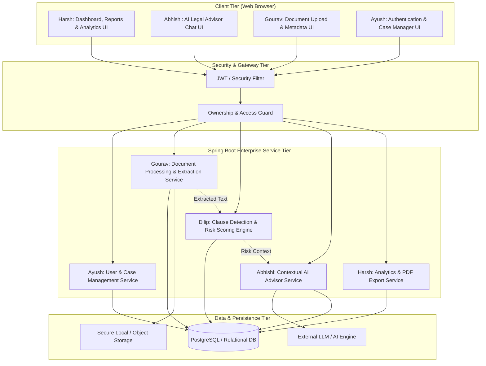

# ⚖️ Legal Document Analyser & Advisor
### *Advanced Java Project-Based Learning (PBL) — 5th Semester*

---

## 📌 Executive Summary

**Legal Document Analyser & Advisor** is an enterprise-grade Java web application designed to automate the ingestion, analysis, clause risk assessment, and document-aware advisory for complex legal contracts and agreements (e.g., NDAs, Employment Agreements, Service Contracts, Terms of Service).

The application extracts raw textual content from uploaded legal documents (`.pdf`, `.docx`), identifies critical contractual clauses, evaluates legal liabilities using an explainable risk-scoring engine, and enables conversational AI interaction constrained strictly to the document's context.

> 🔗 **Reference Prototype:** This repository represents the modular, production-ready Advanced Java rebuild of our initial proof-of-concept prototype:  
> **[Legal-Document-analyser-and-adviser- (Reference Prototype)](https://github.com/gouravnagori/Legal-Document-analyser-and-adviser-)**  
> *The prototype serves as an algorithmic and functional reference while this codebase implements clean enterprise Java standards, layered architecture, strict database persistence, and modular ownership.*

---

## ⚠️ Important Legal & Safety Disclaimer

> ### ⚖️ Informational Tool Disclaimer
> **This software is an AI-assisted informational and productivity tool.**  
> - It **does NOT** provide formal legal advice, legal representation, or binding contract certification.
> - The risk scores, clause classifications, and conversational explanations generated by the system are for educational, informational, and triage purposes only.
> - Users and organizations should always consult a licensed attorney or qualified legal professional before executing legal agreements or relying on automated risk evaluations.

---

## 🎓 Academic Focus (Advanced Java PBL)

This project strictly adheres to 5th-Semester Advanced Java curriculum standards and best practices:

| Core Concept | Implementation Detail |
| :--- | :--- |
| **Framework & REST Services** | Spring Boot 3 web layer providing clean, stateless RESTful APIs. |
| **Persistence & ORM** | Spring Data JPA with Hibernate for relational mapping, entity lifecycle management, and transactional boundaries. |
| **Authentication & Security** | Spring Security with BCrypt password hashing, role/ownership enforcement, and stateless session management / JWT. |
| **File I/O & Extraction** | Apache Tika / Apache POI / PDFBox for high-throughput stream processing of multi-page legal documents. |
| **Robust Exception Handling** | Global exception handlers (`@ControllerAdvice`, `@ExceptionHandler`) with standardized API error responses. |
| **Design Patterns** | Controller-Service-Repository pattern, DTO pattern, Factory & Strategy patterns for clause analysis, and Service Abstractions. |
| **Testing & Quality** | Unit & integration testing using JUnit 5, Mockito, and Spring Boot Test slices. |

---

## 🏛️ System Architecture

